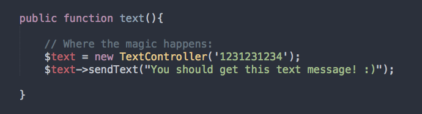

# Twilio Controller for Laravel and Lumen

2 lines to send a text using Twilio (for Laravel and Lumen)

### Instructions:
- Add `TextController.php` into your Controllers folder
- Edit your `.env` file to insure that the 3 new variables form this `.env` file are added (with your Twilio API info)
- Include the `TextController` anywhere you want to send a text message
- Pass in a phone number into a new instance of `TextController` and then call the `text()` with e "text message" as the parameter.

Feel free to look at the [ExampleController](ExampleController.php) to see how it all works together.